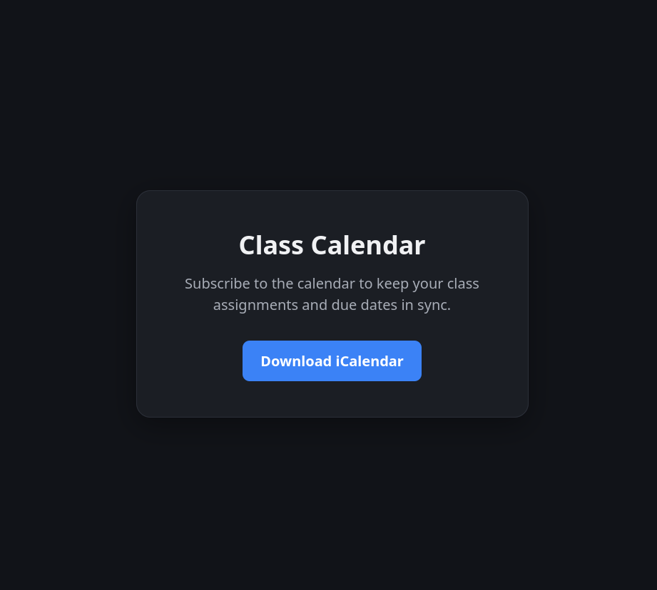

# CanvasICALMerger

Canvas by Instructure provides a really nice api. They publish a ical calender for courses you are enrolled in, however to read it requires your api key and its per class. This small web server reads all your classes calenders and merges them into one, publically (to LAN) file you can import into your calender of choice or even subscribe to.

Just wrote this as a small QOL for my college experince

to run

- Read the [Canvas documentation](https://developerdocs.instructure.com/get_started#id-1.-get-your-access-key) for instructions on creating your api key
- Create a .env file with the lines `CANVAS_TOKEN="xxxxxxxxxxxxxxxxxxx[YOUR API KEY]xxxxxxxxxxxxxxxxxxx"` and `CANVAS_URL="[YOUR CANVAS URL]"`
- Install the required packages `pip install -r install.txt`
- Run the server `python3.14 app.py`
- Go to `http://[yourserver]:8080`
- Click "Download ICalender"

